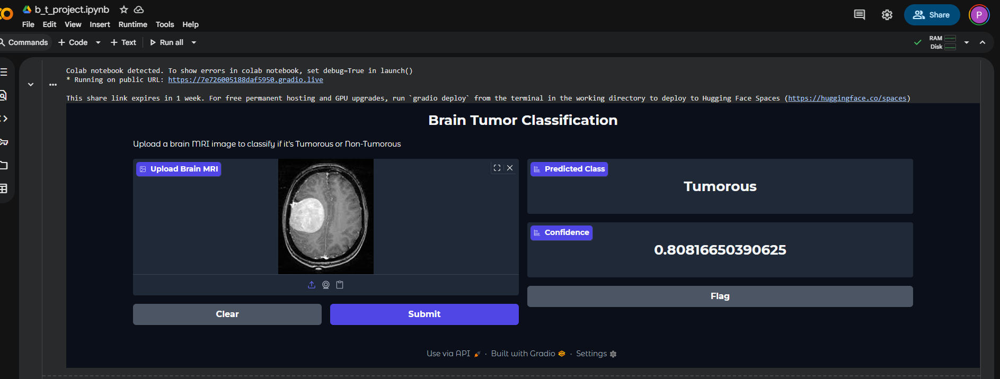
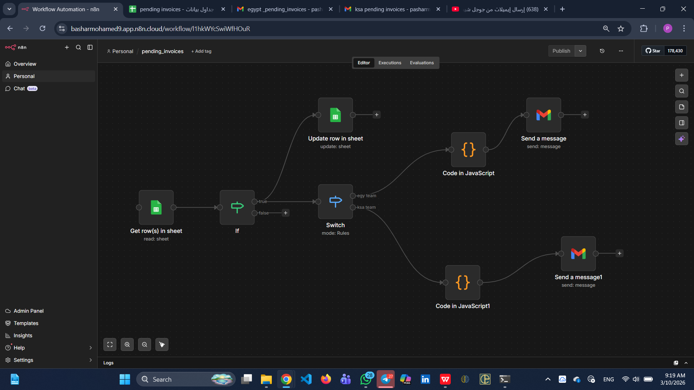

Portfolio: Bashar Mohamed
Artificial Intelligence Student at Beni-Suef University
Machine Learning and Automation Engineer

---

Professional Summary
Focused on developing scalable AI solutions and automating business workflows. Experienced in Computer Vision, Natural Language Processing, and Backend Automation.

---

Technical Projects

1. Brain Tumor Classification
Development of a Deep Learning model utilizing Convolutional Neural Networks (CNNs) for the automated detection and classification of brain tumors from MRI scans.

2. Workflow Automation (n8n)
Architecting and implementing automated data pipelines. Integration of Python and JavaScript for dynamic reporting and process optimization.

3. Sentiment Analysis (RoBERTa)
Implementation of a Transformer-based model for high-accuracy text classification, achieving a 94% success rate on sentiment evaluation tasks.

---
Contact Information

LinkedIn: [basharmohamed9](https://www.linkedin.com/in/basharmohamed9)
GitHub: [pasharmohamed](https://github.com/pasharmohamed)
Email: pasharmohamed8@gmail.com
